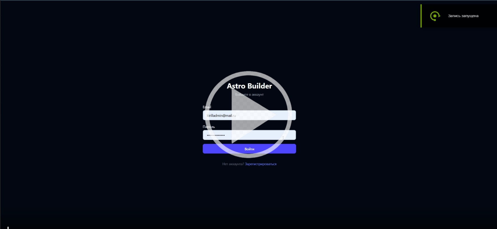
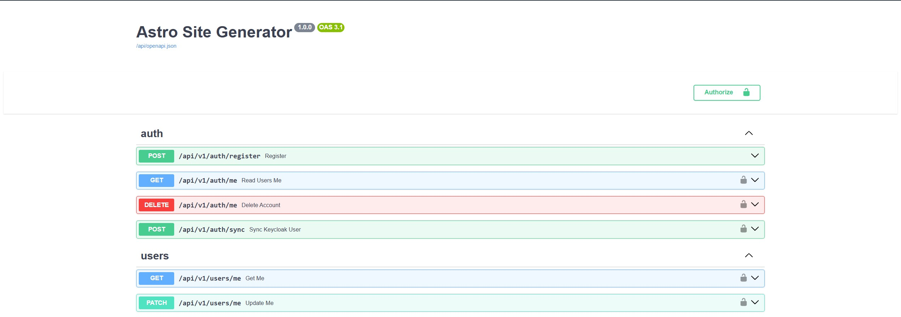
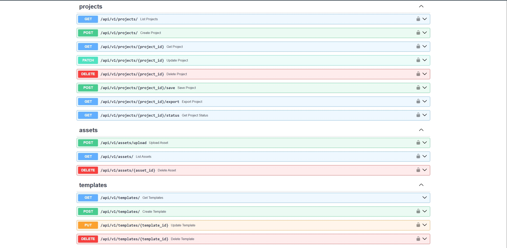
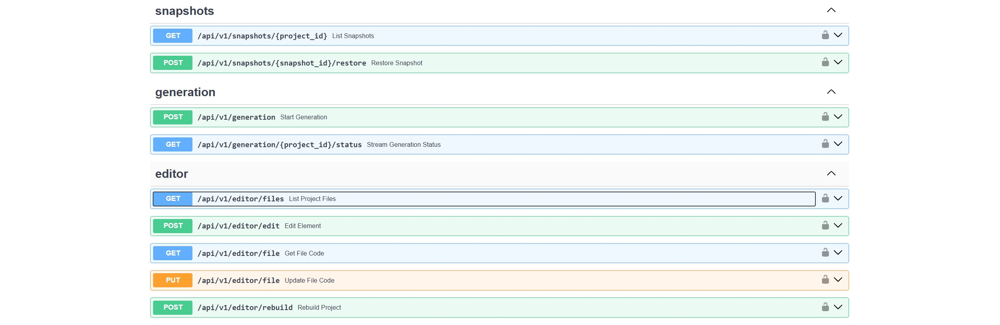
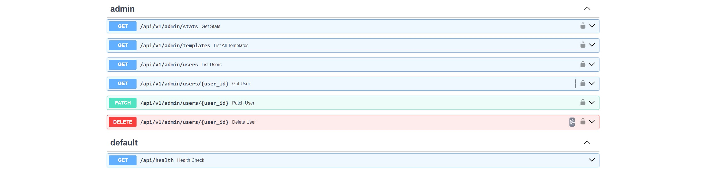

---

## 🎥 Демонстрация работы

Ниже представлен видеоролик с демонстрацией работы сервиса. Нажмите на изображение, чтобы посмотреть:

[](https://drive.google.com/file/d/1PJjc9Gvx9LxXwgB1n0MwLxRYykvv7ivC/view?usp=sharing)

### ⏱ Таймкоды

* **00:00** — [Вход в сервис]
* **00:10** — [Начало создания проекта]
* **00:33** — [Начало генерации проекта]
* **01:49** — [Страница редактирования проекта]
* **01:57** — [Выбор элемента для редактирования и написание запроса для ИИ]
* **02:45** — [Ручное редактирование кода]
* **03:56** — [Выбор предыдущей версии проекта]
* **04:38** — [Экспорт сделанного проекта]
* **04:45** — [Функционал администратора]


## 🛠 Технологический стек

### Frontend
- **React 18** + **TypeScript**
- **Vite** — быстрый сборщик
- **Zustand** — управление состоянием
- **Tailwind CSS** — стилизация

### Backend
- **FastAPI (Python)** — высокопроизводительный API
- **PostgreSQL** + **SQLAlchemy** (Alembic) — база данных
- **Celery** + **Redis** — фоновые задачи (генерация, сборка, деплой)
- **MinIO (S3)** — хранение пользовательских файлов и ассетов

### Инфраструктура & LLM
- **Docker** & **Kubernetes** — контейнеризация и оркестрация
- **Keycloak** — Identity and Access Management
- **LLM API** — микросервис для взаимодействия с языковыми моделями (Llama Engine)

---


## 📂 Структура проекта

```text
├── backend/          # FastAPI сервер, логика, Celery воркеры
├── frontend/         # React приложение (Web IDE, дашборд)
├── llm-api/          # Микросервис для работы с LLM (Llama)
├── infrastructure/   # Конфигурации Docker Compose, Kubernetes, Nginx
└── assets/           # Медиафайлы для документации
```

---

## Эндпоинты в Swagger






---

